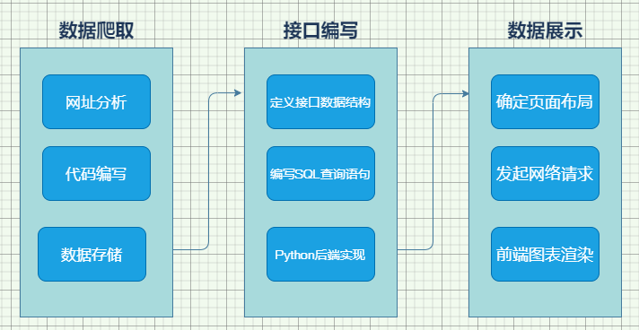

## 猫眼电影数据爬取与分析——说明书

## 一、项目介绍
    将猫眼电影的所有电源详细数据进行爬取，并存储到MySQL数据库中，
    其中包括名称、时间、评分、票房、类别、年代和地区等等关键属性，
    最后编写后端接口，为前端数据可视化展示提供数据支持。
    数据可视化通过微信小程序进行，主要以各种不同类型的图表展现。

## 二、项目分工
    设计分析：熊维建
    数据爬取：滕明城
    数据存储：滕明城
    接口编写：滕明成
    数据可视化：熊维建

目标：https://maoyan.com/films?showType=3&offset=0

将所有数据爬取，并清洗出属性，包括电影名、类别、区域、年份，口碑分、票房、电影时长，
然后将所有数据存储到MySQL数据库中。

流程图：



## 三、接口文档

### （1）折线图

https://v-charts.js.org/#/line

1. 按年：数量、平均分、票房
1. 按月：数量、平均分、票房

年：最高前5年+其它

```js
data = [
  {"年份": 2020, "数量": 526, "平均分": 6.5, "票房": 666},
  {"年份": 2020, "数量": 526, "平均分": 6.5, "票房": 666},
  {"年份": 2020, "数量": 526, "平均分": 6.5, "票房": 666},
  {"年份": "其它", "数量": 2526, "平均分": 6.5, "票房": 666}
]
data = [
  {"月份": 1, "数量": 526, "平均分": 6.5, "票房": 666},
  {"月份": 2, "数量": 526, "平均分": 6.5, "票房": 666},
  {"月份": 8, "数量": 526, "平均分": 6.5, "票房": 666},
  {"月份": 11, "数量": 526, "平均分": 6.5, "票房": 666}
]
```

### （2）饼图

https://v-charts.js.org/#/pie

1. 票房前5的国家 + 其它
2. 票房前5的年份 + 其它
3. 票房前5的类型 + 其它

```js
data = [
  {"国家": "xxx", "票房": 56534},
  {"国家": "xxx", "票房": 56534},
  {"国家": "其它", "票房": 56534}
]
data = [
  {"年份": "xxx", "票房": 56534},
  {"年份": "xxx", "票房": 56534},
  {"年份": "其它", "票房": 56534}
]
data = [
  {"类型": "xxx", "票房": 56534},
  {"类型": "xxx", "票房": 56534},
  {"类型": "其它", "票房": 56534}
]
```
## （3）条形图

https://v-charts.js.org/#/bar


前5+其它

按类别分：国内+国外 的 票房

按年份分：国内+国外 的 口碑均分

```js
data = [
    {"类别": "xx", "国内": 12467, "国外": 5438},
    {"类别": "xx", "国内": 12467, "国外": 5438},
    {"类别": "xx", "国内": 12467, "国外": 5438}
]
data = [
    {"年份": "xx", "国内": 12467, "国外": 5438},
    {"年份": "xx", "国内": 12467, "国外": 5438},
    {"年份": "xx", "国内": 12467, "国外": 5438}
]
```

### （4）雷达图

https://v-charts.js.org/#/radar

前5条 + 其它

1. 类型+平均分+总票房
2. 地区+平均分+总票房

```js
data = [
  {"类型": "爱情", "平均分": 8.6, "总票房": 6666},
  {"类型": "爱情", "平均分": 8.6, "总票房": 6666},
  {"类型": "其它", "平均分": 8.6, "总票房": 6666}
]

data = [
  {"地区": "爱情", "平均分": 8.6, "总票房": 6666},
  {"地区": "爱情", "平均分": 8.6, "总票房": 6666},
  {"地区": "其它", "平均分": 8.6, "总票房": 6666}
]

```


### （4）接口路由&数据结构定义

/api/all

```js
{
  // 一、折线图
  "one": {
    "year": [
      {"年份": 2020, "数量": 666, "平均分":8.6, "票房": 6666},
      {"年份": 2020, "数量": 666, "平均分":8.6, "票房": 6666},
      {"年份": "其它", "数量": 666, "平均分":8.6, "票房": 6666}
    ],
    "month": [   
      {"月份": 1, "数量": 666, "平均分":8.6, "票房": 6666},
      {"月份": 2, "数量": 666, "平均分":8.6, "票房": 6666},
      {"月份": 12, "数量": 666, "平均分":8.6, "票房": 6666}
    ]
  },


  // 二、饼图
  "two": {
    "country": [
         {"国家": "xxx", "票房": 56534},
         {"国家": "xxx", "票房": 56534},
         {"国家": "其它", "票房": 56534}
       ],
    "year": [
          {"年份": "xxx", "票房": 56534},
          {"年份": "xxx", "票房": 56534},
          {"年份": "其它", "票房": 56534}
        ],
    "type": [
          {"类型": "xxx", "票房": 56534},
          {"类型": "xxx", "票房": 56534},
          {"类型": "其它", "票房": 56534}
        ]
  },


  // 三、条形图
  "three": {
    // 按电影类型
    "type": [
        {"类别": "xx", "国内": 12467, "国外": 5438},
        {"类别": "xx", "国内": 12467, "国外": 5438},
        {"类别": "xx", "国内": 12467, "国外": 5438}
    ],
    // 按电影年份
    "year": [
        {"年份": "xx", "国内": 12467, "国外": 5438},
        {"年份": "xx", "国内": 12467, "国外": 5438},
        {"年份": "xx", "国内": 12467, "国外": 5438}
    ]
  },


  // 四、雷达图
  "four": {
    // 1. 类型+平均分
    "type": [
      {"类型": "爱情", "平均分": 8.2, "总票房": 70},
      {"类型": "爱情", "平均分": 8.2, "总票房": 60},
      {"类型": "其它", "平均分": 8.2, "总票房": 42}
    ],
    "area": [
      {"地区": "中国大陆", "平均分": 8.2, "总票房": 70},
      {"地区": "中国大陆", "平均分": 8.2, "总票房": 60},
      {"地区": "其它", "平均分": 8.2, "总票房": 42}
    ]
  }
}
```

## 三、数据爬取

1. 通过Requests发起网络请求，获取纯文本html内容。

    爬取过快防封策略：
    - 不在乎速度，请求间隔设置延迟，睡一觉醒来，需要的数据就都到手了。
    - 在乎速度，通过代理连接池，每个请求都是不同的IP，达到防封效果。

2. 然后将获取的纯文本html内容通过BeautifulSoup库进行数据清洗，提取所需要的数据。
    
    - 分析元素选择器：获取到所需数据的选择器，快速定位到标签。
    - 分析数据特征：数据同标签时，分析分隔符号。
    - 分析反爬策略：自定义字体，分析字库编号，将编号一一对应，实现反反爬。
    
3. 将数据库通过pymsql库存储到预先配置好的MySQL服务器中。
    
    - 存储过程 或 直接SQL语句查询
    
## 四、数据存储

使用Pymysql依赖包连接预先配置好的MySQL服务端，将所有数据按表形式存储在数据库当中。

## 五、接口编写

使用Python当中小巧的Flask框架编写后端接口，主要通过SQL语句对数据库进行查询和处理后，提供数据接口，
处理前端http请求，将数据返回给前端进行展示。

## 六、前端数据展示

1. 通过前端[Vue.js](https://vuejs.org/) 框架，进行快捷的Web前端界面逻辑编写。
2. 通过软件包 [Axios](https://www.npmjs.com/package/axios) ，发起异步网络请求，向后端获取数据。
3. 通过开源的 [v-charts](https://github.com/ElemeFE/v-charts) 图表组件，进行数据展示。

